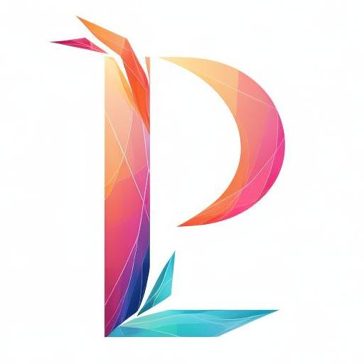

<p align="center">
  <a href="" rel="noopener">
 </a>
</p>

<h3 align="center">PyTorchLab</h3>

<div align="center">


[](/LICENSE)

</div>

---

<p align="center"> Realize some AI code with PyTorch and Lightning.
    <br> 
</p>

## 📝 Table of Contents

- [📝 Table of Contents](#-table-of-contents)
- [Install ](#install-)
- [Usage ](#usage-)
- [✍️ Authors ](#️-authors-)
- [🎉 Acknowledgements ](#-acknowledgements-)


## Install <a name = "getting_started"></a>
```requires-python = ">=3.10,<3.12"```
```shell
pdm install
# or
pip install -e .
```
## Usage <a name = "usage"></a>
See docs.

## ✍️ Authors <a name = "authors"></a>

- [@TaoChenyue](https://github.com/TaoChenyue) - Idea & Initial work

See also the list of [contributors](https://github.com/TaoChenyue/PyTorchLab/graphs/contributors) who participated in this project.

## 🎉 Acknowledgements <a name = "acknowledgement"></a>

- Hat tip to anyone whose code was used
- Inspiration
- References
1. [lightning-bolts](https://github.com/Lightning-Universe/lightning-bolts)
2. [PyTorch-GAN](https://github.com/eriklindernoren/PyTorch-GAN.git)
