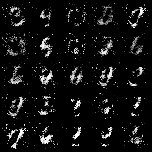
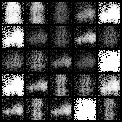
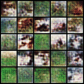

### GAN
[[Paper-2014]](https://arxiv.org/abs/1406.2661) [[Code]](../src/pytorchlab/models/gans/gan/gan.py)
```shell
python main.py fit -c example/gans/gan.yml
```
| Dataset      | GAN                                                 |
| ------------ | --------------------------------------------------- |
| MNIST        |                |
| FashionMNIST |  |
### DCGAN
[[Paper-2015]](https://arxiv.org/abs/1511.06434) [[Code]](../src/pytorchlab/models/gans/dcgan/dcgan.py)
```shell
python main.py fit -c example/gans/dcgan.yml
```
| Dataset      | GAN                                           |
| ------------ | --------------------------------------------- |
| CIFAR10      |  |